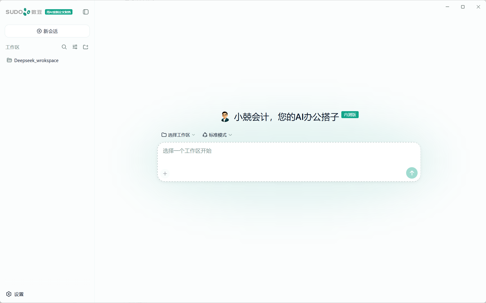

# 小兢会计

[English](README.md) | 中文

<p align="center"></p>

**小兢会计——您的 AI 办公搭子**是一款面向日常办公与财务工作场景的 Windows 桌面 agent（智能体），将桌面交互、本地工作区和可配置的 AI 模型服务整合为可安装应用。

## 产品功能

- **安装即可运行的 Windows 应用：**安装程序自带 Node.js 运行时，终端用户无需另行安装 Node.js。
- **本地工作区：**应用会在用户的“文档”目录下创建`小兢会计工作区`，agent 可在用户授予的权限范围内处理文件和执行命令。
- **提示词文件附件：**用户可以把本地文件上传到当前提示词，在发送前移除待发送文件，并在设置中管理已上传文件。
- **可编辑的模型设置：**用户在启动后配置 DeepSeek API Key，也可以随时返回同一设置页面更换密钥。
- **数豆产品体验：**界面、产品名称、视觉体系、初次使用说明、安装程序和默认部署配置均围绕小兢会计进行定制。



<a id="run"></a>

## 安装与启动

对外发布的安装程序支持 64 位 Windows 10 和 Windows 11。

1. 从公司发布页面下载 Windows 安装程序。
2. 运行安装程序并选择一个父文件夹，安装程序会自动补充固定的 `xiaojing-agent-desktop` 应用目录。
3. 从桌面或开始菜单启动小兢会计，应用会自动启用内置运行时。

## 配置 API Key

1. 登录 [DeepSeek 开放平台](https://platform.deepseek.com/)并创建 API Key。
2. 在小兢会计中打开**设置 → 模型**，找到 DeepSeek 并选择**编辑**。
3. 将密钥粘贴到**API 密钥**并保存；需要更换时，返回同一页面输入新密钥即可。
4. API Key 属于敏感信息，请勿通过聊天、截图或文件分享给他人。

<a id="run-from-source"></a>

## 从源码开发

源码开发需要 Node.js `^22.19.0` 或 `>=24.0.0`，以及 pnpm `11.7.0`。

```sh
git clone git@github.com:yyshi127/sudotech_agent_harness.git
cd sudotech_agent_harness
corepack enable
pnpm install
pnpm desktop:dev
```

使用以下命令构建 Windows 安装程序：

```sh
pnpm desktop:dist
```

生成的安装程序位于 `apps/desktop/dist/installer/`。构建产物和内置运行时二进制文件不会提交到 Git。

## 仓库结构

- `apps/desktop/`：Electron 桌面外壳、启动页、安装配置和桌面资源。
- `apps/web/`：集成到桌面应用中的 Web 界面。
- `apps/xiaojing-download/`：Windows 下载静态页面。
- `packages/`：DeepSeek Harness 的功能包及面向本产品的界面定制。

## 上游来源与归属

本仓库直接基于 [DeepSeek Harness](https://github.com/deepseek-ai/deepseek-harness) 开源源码构建，该项目由 [DeepSeek AI](https://deepseek.com) 开发。瑞华云数豆科技面向内部及授权产品场景，对界面、品牌、默认配置和 Windows 封装进行定制。

小兢会计并非对底层 agent harness 的独立重新实现，也不是 DeepSeek 官方发行的桌面版本。源码和安装程序均继续保留 DeepSeek Harness 的来源说明及第三方许可证信息。

## 项目状态

小兢会计目前处于内部测试阶段，仅面向授权用户使用。不同版本之间的界面、配置和安装行为可能发生变化。

## 许可证

DeepSeek Harness 源码继续遵循 [MIT 许可证](LICENSE)，第三方依赖及其许可证见 [THIRD_PARTY_NOTICES.md](THIRD_PARTY_NOTICES.md)。
