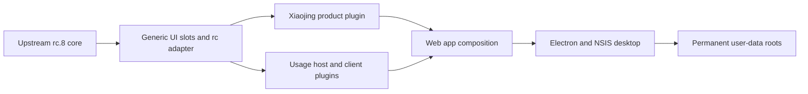

# Xiaojing Accounting product development baseline (0.2.0)

English | [中文](xiaojing-product-development.zh.md)

This reference defines how Xiaojing Accounting is assembled on DeepSeek Harness, which source layer owns each customization, and which compatibility rules a later development session must preserve. It describes the current 0.2.0 source baseline on official rc.8; package READMEs own package-level details, while the [0.1.9 architecture decision](../.agents/notes/implemented/architecture/2026-08-20-xiaojing-product-accounting-and-desktop-upgrades.md) and the [rc.8 upgrade decision](../.agents/notes/implemented/architecture/2026-08-20-xiaojing-rc8-upgrade.md) own the rationale and rejected alternatives.

## Read this first

Before editing product code, identify the owning layer instead of starting from the visible component. The following rules are release requirements:

- Product names, logos, copy, theme values, onboarding, and the default deployment persona belong to the Xiaojing product plugin or application metadata, never directly in an official UI owner.
- New behavior is a Cordis plugin that uses an existing extension point, Remote, event, or slot. A minimal provider-neutral extension point may be added to an official package when none exists; product behavior must not be embedded there.
- Installer identity and permanent user-data paths are compatibility identifiers. They do not change during ordinary product or upstream upgrades.
- Preview and focused verification precede packaging. Do not build or install a Windows release until the requested behavior has been accepted in the running preview.

## Milestone baseline

| Item | Current value | Source of truth |
|---|---|---|
| Desktop product version | `0.2.0` | [`apps/desktop/package.json`](../apps/desktop/package.json) |
| Official Harness baseline | `0.1.0-rc.8` | [`product.json`](../packages/client/xiaojing-product/product.json) |
| Official baseline commit | `141eb6fef83422698aef7a981029e843e8161534` | [`product.json`](../packages/client/xiaojing-product/product.json) |
| Product integration base | `8d7ded5a542a8fe99394e27b27e69cd3472838a3` | [`product.json`](../packages/client/xiaojing-product/product.json) |
| Source repository | `git@github.com:yyshi127/sudotech_agent_harness.git` | Git `origin` |

`product.json` is the explicit upstream record; do not infer the baseline from similar-looking source. The `@deepseek-ai/dsh-*` package scope remains the repository-wide workspace convention, while the desktop package uses `@sudotech/xiaojing-accounting-desktop`. Product copy and attribution must continue to state that Xiaojing Accounting is based on DeepSeek Harness with internal branding and configuration, not that Sudotech developed the underlying framework.

## Architecture



The lowest layer that can own a change owns it. Official packages expose neutral extension points; product and feature plugins implement observable behavior; the Web bundle composes those plugins; Electron packages the assembled application without becoming the owner of browser features.

## Source ownership

| Layer | Responsibility | Primary sources |
|---|---|---|
| Official-compatible UI owners | Product-neutral slots, owner props, fallback UI, and generic startup-logo metadata reading | `packages/client/ui-sidebar/`, `packages/client/ui-conversation/`, `packages/client/ui-settings-models/`, `packages/client/web/` |
| Xiaojing product layer | Brand components, palette, product copy, onboarding, and default deployment persona | [`packages/client/xiaojing-product/`](../packages/client/xiaojing-product/README.md) |
| Usage Host plugin | Provider usage observation, API-key fingerprinting, built-in pricing, immutable ledger, Remote, and update event | [`packages/llm/usage-accounting/`](../packages/llm/usage-accounting/README.md) |
| Usage Client plugin | Sidebar summary and detail panel, Settings entry, monthly calendar, formatting, and refresh controller | [`packages/client/ui-usage-accounting/`](../packages/client/ui-usage-accounting/README.md) |
| Web composition | Host and browser plugin roster and load order | [`packages/bundle/web-app/cordis.patch.yml`](../packages/bundle/web-app/cordis.patch.yml) |
| Independent integration patches | API-key post-configuration, profile runtime-shadow protection, and file-upload composer repair | [`apps/desktop/integration-patches.json`](../apps/desktop/integration-patches.json) |
| Desktop and installer | Electron lifecycle, bundled Node runtime, icons, splash, fixed window identity, NSIS configuration, and release checks | [`apps/desktop/`](../apps/desktop/README.md) |
| Durable API reference | Client-safe usage types, Remote method, and update event | [`docs/subsystems/usage-accounting.md`](subsystems/usage-accounting.md) |

Do not duplicate detailed package contracts in this document. Update the owning README or subsystem reference first, then keep this page as the cross-layer map and continuation procedure.

## UI and product isolation

### Generic owners

The official-compatible UI roots expose five Xiaojing-required single-owner slots: `sidebar.brand.mark`, `sidebar.brand.name`, `conversation.hero.brand.mark`, `conversation.hero.brand.content`, and `onboarding.content`. Each owner retains a neutral fallback so the upstream-style application still runs when the product plugin is absent. Generic code may define owner props, layout space, design tokens, metadata keys, and fallback rendering; it may not import the Xiaojing package or mention Xiaojing, Sudotech, SUDO, product asset filenames, or product copy.

[`scripts/verify-xiaojing-product-layer.mjs`](../scripts/verify-xiaojing-product-layer.mjs) scans the official UI source roots for product marks, verifies each declared slot, verifies inventoried assets and desktop manifests, and requires the Web composition to load the product plugin. A packaging command fails when this isolation check fails.

### Product plugin

`@deepseek-ai/dsh-client-xiaojing-product` has a Host face and a browser face. The Host face fills an empty `deployment:persona` section with the Xiaojing identity but never replaces a selected or user-created agent persona. The browser face registers the five product slots, localized copy, and theme CSS as one unloadable plugin, and its registrations are compiled only by the `xiaojing` Client build profile.

All ordinary brand changes start in this package. Add or replace the asset in the application public assets, update `product.json` when the inventory changes, and reference it from the product component. Do not solve a missing product presentation by directly editing `SidebarRoot`, `EmptyHero`, `WelcomeNotice`, or another official owner.

### Startup surfaces

There are two startup presentations, and both must remain branded:

1. [`apps/desktop/loading.html`](../apps/desktop/loading.html) is the Electron splash displayed while the local Host starts. It owns desktop-only product copy and the local splash asset.
2. The `xiaojing` entry in [`scripts/client-build-environment.ts`](../scripts/client-build-environment.ts) injects `dsh-boot-logo` metadata into the built Web shell. The generic boot page reads that metadata and retains `HARNESS` as its fallback; [`apps/web/index.html`](../apps/web/index.html) itself stays product-neutral.

A startup-brand change is incomplete if only one surface is checked. Verify the Electron splash, the Web plugin-loading screen, the expanded and collapsed sidebar, the empty-conversation hero, and onboarding.

### Adding product UI

1. Decide whether the change is brand presentation or a reusable feature. Brand presentation belongs in `xiaojing-product`; a reusable feature gets its own Host and/or Client package.
2. Use an existing slot when its owner props provide the required state and actions.
3. If no slot exists, add the smallest provider-neutral slot to the owning official package, retain a complete fallback, and add owner and snapshot tests.
4. Add the slot name to `product.json` only when the Xiaojing product plugin consumes it, then extend the product-layer check if the ownership rule changes.
5. Register the product renderer from the product package and verify unloading it restores the generic fallback.

## Functional plugin isolation

### Local usage accounting

The accounting feature does not modify the agent loop. `@deepseek-ai/dsh-usage-accounting` observes actual `deepseek-official` calls through the rc.8 `llm/stream` waterfall. [`compat.ts`](../packages/llm/usage-accounting/src/compat.ts) is the only file that imports the rc-specific stream, token usage, DeepSeek settings, endpoint, and credential APIs. An upstream API change should therefore be absorbed there before changing settlement, storage, pricing, or UI logic.

Each request settles at most once on its first provider `usage` chunk. Conversation, compaction, title, and retry requests remain distinct. The ledger stores only a SHA-256 key fingerprint, request metadata, disjoint token buckets, the request-time tariff version, integer-nanoyuan category costs, total cost, and unpriced tokens. The browser receives only `usageAccounting.snapshot()` and the `usage-accounting/updated` refresh signal; it never receives a key or fingerprint.

The built-in Flash and Pro table in [`pricing.ts`](../packages/llm/usage-accounting/src/pricing.ts) is the only tariff source. Startup performs no pricing request. The UI rounds exact nanoyuan values to fen for display and always shows two decimals; the ledger retains nanoyuan precision. Unknown models, custom endpoints, and cache-write tokens remain counted but unpriced. This is a local estimate from provider usage, not a DeepSeek Platform invoice or balance.

### Bundled third-party plugin

The shipped Web profile includes only `dsh-file-uploads` through [`PROFILE_TEMPLATES`](../packages/boot/app-boot/src/profile.ts). Its source commit is pinned by the application dependency graph, and a local pnpm patch fixes attachment layout and caret behavior. ModLens and its visual bridge are not part of 0.2.0. On first rc.8 load, only the exact installation-owned 0.1.9 tuple `base + web-app + ModLens + file uploads` migrates atomically to `base + web-app + file uploads`; a reordered, extended, or otherwise customized bundle list remains byte-identical. A bundled plugin change is a source change and requires focused tests, preview, and a new installer. A user-installed profile plugin must consume the application runtime through peer dependencies; profile-local Harness or Cordis runtime copies are rejected and a newly introduced shadow is rolled back.

### Adding a capability

1. Put model- or Host-side behavior in a dedicated Cordis package and use the documented extension point rather than editing `agent-loop`.
2. Put browser presentation in a separate `dsh.client` package that consumes generic slots and generated Remote clients.
3. Define client-safe Remote fields and events in the owning Host package; do not expose credentials, filesystem internals, or mutable stores to the browser.
4. Isolate upstream-version imports in one compatibility adapter when the extension API is likely to change between rc releases.
5. Add both packages to the Web composition and its dependency manifests, then regenerate Typert and documentation artifacts through the repository commands rather than editing generated files.
6. Add package tests, an assembled keyless browser snapshot when behavior is user-visible, package READMEs, and an Agent Note for the decision.

## Independent integration patches

| Patch id | Contract | Owned paths |
|---|---|---|
| `desktop-api-key-environment-isolation` | The desktop removes inherited `DEEPSEEK_API_KEY`; rc.8's writable credential UI lets users create or replace the credential after launch. | `apps/desktop/main.mjs` |
| `profile-runtime-shadow-protection` | User plugin installation cannot replace the application-owned Harness or Cordis runtime and restore the upstream interface. | CLI and app-boot profile loading |
| `file-upload-composer-repair` | Pending attachment layout does not cover the composer, and the visible caret matches the insertion point. | `patches/dsh-file-uploads@1.0.0.patch` |

These contracts are neither branding nor claimed upstream behavior. Keep their ids and paths in `integration-patches.json`. When upstream implements the same contract, remove or narrow the patch in an explicit change with regression tests and update the inventory; do not silently delete it during a merge.

## Runtime composition

1. Electron reads `identity.json`, pins `userData`, obtains the single-instance lock, fixes the AppUserModelId and window title, and displays the desktop splash.
2. The desktop starts its bundled `runtime/node.exe`; an end-user Node installation is neither required nor selected.
3. The child process runs `dsh web --port 0` from `%USERPROFILE%\Documents\小兢会计工作区`, with `DSH_HOME` set to the permanent `harness` data directory and inherited DeepSeek API-key environment variables removed.
4. The `web` profile composes the base bundle, Web application bundle, and file uploads. The Web bundle loads the usage Host plugin, Xiaojing product plugin, usage Client plugin, and ordinary rc.8 Harness UI packages.
5. The API gateway exposes generated Remotes to the isolated renderer. Electron denies permission requests and externalizes new-window URLs to the operating-system browser.
6. When the Host announces its dynamically assigned local URL, Electron replaces the splash with the assembled Web application while retaining the fixed taskbar title and icon.

The packaged desktop intentionally uses an ephemeral local port. Port `3090` is a development-preview convention, not a desktop identity or runtime constant.

## Data and in-place upgrades

### Permanent paths

| Data | Permanent location | Owner |
|---|---|---|
| Electron state | `%APPDATA%\@sudotech\xiaojing-accounting-desktop` | `app.setPath('userData', ...)` before the single-instance lock |
| Harness state | `%APPDATA%\@sudotech\xiaojing-accounting-desktop\harness` | `DSH_HOME` passed to the bundled Host |
| User workspace | `%USERPROFILE%\Documents\小兢会计工作区` | Desktop working directory |

[`user-data-contract.json`](../apps/desktop/user-data-contract.json) inventories sessions, settings, credentials, agent presets, profiles, storages, uploads, usage accounting, Local Storage, and the Documents workspace. The installer owns only application files. It must not read, rewrite, or delete these data paths during an ordinary upgrade or uninstall.

### Immutable installer identity

[`identity.json`](../apps/desktop/identity.json) is the single source for package name, App ID/AppUserModelId, NSIS GUID, installation directory name, executable name, product name, per-user scope, shortcut name, and user-data path segments. Treat every field as immutable during ordinary releases. `verify-desktop-identity.mjs` compares the manifest, Electron entry, and NSIS configuration against the fixed values and rejects drift.

The version in `apps/desktop/package.json` must increase for every distributed installer. With the same identity, NSIS recognizes the existing installation, reuses `InstallLocation`, skips the directory page, replaces application files, and refreshes shortcuts. Moving the installation directory still requires uninstall and reinstall; changing identity would create a second application rather than an upgrade.

### Durable format changes

1. Keep existing files byte-identical when the current reader supports them.
2. When a new release cannot read an old schema, add a versioned migration that writes atomically and preserves the original on failure.
3. Replace the synthetic upgrade fixture with data from the immediately previous formal release and cover every protected path.
4. Block packaging until old sessions, credentials, personas, plugins, attachments, workspace files, UI state, and accounting data remain usable after migration.

`verify-user-data-contract.mjs` materializes a real Zstandard session from the synthetic 0.1.9 fixture, applies an application-file replacement, and requires every protected byte to remain unchanged. It then permits exactly one atomic mutation: the installation-owned Web profile manifest migration that removes ModLens. The same gate opens the old session through rc.8, verifies its title, messages, and persona binding, checks that the API Key is readable and replaceable without printing it, validates the user preset and settings, and proves the current-key accounting totals and category costs. This gate does not replace a real Windows in-place upgrade test.

## Development workflow

### Before editing

1. Read the root `AGENTS.md`, [`docs/architecture.md`](architecture.md), this document, and the owning package README.
2. Run `git status --short` and preserve unrelated or pre-existing work; never reset the working tree to reach the upstream baseline.
3. Read `product.json`, `identity.json`, `integration-patches.json`, and `user-data-contract.json` when the change crosses product, plugin, or desktop layers.
4. State which layer owns the requested behavior and which generic extension point it uses before changing code.
5. Define an observable preview result and the focused test that will prove it.

### Preview and verify

Build once and launch the composed Web application, not standalone Vite:

```sh
pnpm run build:xiaojing
pnpm dsh web --port 3090
```

For repeated Client-plugin edits, run the watcher in another terminal after the initial build:

```sh
pnpm run dev:web
```

The bare `apps/web` Vite server is not a valid product preview because it lacks the Host-generated `window.__DSH_BOOT__` plugin roster. Host package, composition, shell, and application-entry changes require the appropriate rebuild and page or process restart; Client bundle changes can use the existing HMR path. Use `pnpm desktop:dev` when Electron lifecycle, splash, taskbar, native dialogs, bundled runtime behavior, or window layout must be verified.

Run the focused product checks before broader repository checks:

```sh
pnpm exec vitest run packages/client/xiaojing-product/tests packages/llm/usage-accounting/tests packages/client/ui-usage-accounting/tests
pnpm --filter @sudotech/xiaojing-accounting-desktop run verify:identity
pnpm --filter @sudotech/xiaojing-accounting-desktop run verify:user-data
pnpm --filter @sudotech/xiaojing-accounting-desktop run verify:product-layer
```

Then run the repository checks matched to the changed files. Documentation changes require `pnpm run doc-sync`, `pnpm run lint`, and `git diff --check`; code changes require focused behavior tests, the relevant build or typecheck, and the repository pre-push workflow.

### Package only after acceptance

After the user accepts the running preview, increment the three-part desktop version and run:

```sh
pnpm desktop:dist
```

The command builds the repository, verifies desktop identity, user-data retention, and product isolation, prepares the bundled Node runtime, and writes the NSIS installer to `apps/desktop/dist/installer/`. Copy the accepted installer and blockmap to `release/windows/` for publication; neither generated directory is source. Do not install the package on the user's machine unless installation is explicitly requested.

A green build is not the complete release decision. Test a clean per-user install and an in-place upgrade from the previous formal installer on Windows, including a custom installation path, before publishing.

## Upstream upgrade procedure

1. Start from stable `main` and create `codex/upgrade-rcX`; do not perform the upgrade on the release branch.
2. Fetch `upstream`, verify the official tag and commit, and record the intended baseline in `product.json` as an explicit reviewed change.
3. Merge the verified upstream commit. Do not reset, overwrite, or recopy the repository over product work.
4. Resolve official UI conflicts by preserving only generic slots, owner props, fallback behavior, and metadata reading in official-compatible packages.
5. Adapt `packages/llm/usage-accounting/src/compat.ts` to changed LLM, settings, or credential APIs; keep settlement, pricing, ledger, Remote fields, and Client UI unchanged unless the product requirement itself changed.
6. Audit every entry in `integration-patches.json`. Preserve it, adapt its narrow owned paths, or retire it only when upstream now provides the same tested contract.
7. Regenerate Typert, catalogs, graphs, lockfiles, and paired documentation through their owner commands; never resolve generated-file conflicts by hand while their source remains stale.
8. Add an atomic migration and previous-release fixture before accepting any incompatible durable format.
9. Run focused tests, assembled Web preview, full build, clean Windows install, and previous-version in-place upgrade before merging the branch.

Expected conflict zones are the generic slot owners, the accounting compatibility adapter, independent integration-patch paths, generated API/docs artifacts, and dependency manifests. Product components, brand assets, tariff policy, accounting ledger semantics, installer identity, and permanent data roots do not move merely because upstream files changed.

## Release-blocking checks

- `scripts/verify-xiaojing-product-layer.mjs` passes and official UI source roots contain no product marks.
- The assembled application loads `xiaojing-product`, usage Host, and usage Client plugins; generic fallbacks still work without the product plugin.
- API-key creation and replacement work after launch, and no plaintext key enters usage records or browser snapshots.
- Usage accounting settles each provider request once, applies Beijing peak windows and the built-in model table, preserves historical request-time costs, and displays two decimal places.
- ModLens and the visual bridge are absent; file upload, attachment layout, composer caret behavior, exact default-profile migration, and profile runtime-shadow protection pass focused checks.
- Both startup surfaces, expanded and collapsed sidebar, hero, onboarding, taskbar title, and taskbar/shortcut icons show the intended product identity.
- Desktop identity and user-data verifiers pass with the incremented version.
- A clean installation works at the default and a custom parent path, automatically appending `xiaojing-agent-desktop`.
- An in-place upgrade retains the existing installation path and leaves only one Control Panel entry and one application identity.
- Sessions, messages, selected and user-created personas, settings, credentials, plugins, attachments, workspaces, Local Storage, and usage data remain available after upgrade.

Failure of any applicable item blocks publication. Do not treat successful installer generation as proof of an upgrade or data-preservation result that was not exercised.

## Known limits

- The Windows installer is not Authenticode-signed, so Windows may show an unknown-publisher or SmartScreen warning.
- Updates require downloading and running a newer installer; there is no in-application updater.
- Local accounting starts when the plugin first creates its ledger, exposes only the current key and current Beijing month, and does not reconstruct old conversations.
- Local cost is calculated from provider usage and the built-in public tariff; it is not an official platform bill, balance, or server-side reconciliation.
- Tariff changes require a product release because runtime pricing has no remote source or cache.
- A future upstream release can require changes to generic slots, the rc adapter, integration patches, or data migration, but it must not require reimplementing the product and feature layers.

## Quick handoff for a new session

A new development session should begin by reporting the current desktop version, official baseline, dirty-worktree state, requested behavior owner, intended extension point, preview method, and focused verification. If the proposed first edit is a product string or asset inside an official UI component, stop and move the change to the product plugin or add a neutral slot. If the proposed release changes an identity field or persistent path, stop and design an explicit migration before continuing.
