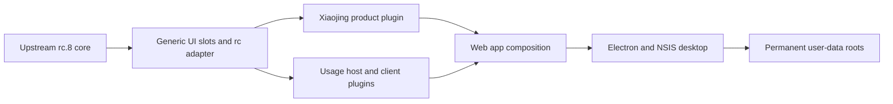

# 小兢会计产品开发基线（0.2.0 / rc.8）

[English](xiaojing-product-development.md) | 中文

本文档说明小兢会计如何基于 DeepSeek Harness 完成组合、各类定制应由哪一层源码负责，以及后续开发会话必须保留哪些兼容规则。本文描述基于官方 rc.8 的当前 0.2.0 源码基线；包级细节由各包 README 负责，[0.1.9 架构决策](../.agents/notes/implemented/architecture/2026-08-20-xiaojing-product-accounting-and-desktop-upgrades.md)与 [rc.8 升级决策](../.agents/notes/implemented/architecture/2026-08-20-xiaojing-rc8-upgrade.md)负责记录原因和被否决的替代方案。

## 开始前必读

修改产品代码前，应先确定负责该行为的层级，不能从当前可见组件直接开始修改。以下规则属于发布要求：

- 产品名称、Logo、文案、主题值、初次使用说明和默认部署人格属于小兢产品插件或应用元数据，不能直接写入官方 UI owner。
- 新行为应实现为使用现有扩展点、Remote、事件或 slot 的 Cordis 插件。现有扩展点不足时，可以在官方包增加最小且与提供方无关的扩展点，但产品行为不能嵌入该包。
- 安装器身份和永久用户数据路径属于兼容标识，普通产品升级或上游升级不能修改它们。
- 打包前必须先完成预览和聚焦验证。在运行中的预览获得认可之前，不得构建或安装 Windows 发布版。

## 里程碑基线

| 项目 | 当前值 | 真源 |
|---|---|---|
| 桌面产品版本 | `0.2.0` | [`apps/desktop/package.json`](../apps/desktop/package.json) |
| 官方 Harness 基线 | `dsh-v0.1.0-rc.8` | [`product.json`](../packages/client/xiaojing-product/product.json) |
| 官方基线 commit | `141eb6fef83422698aef7a981029e843e8161534` | [`product.json`](../packages/client/xiaojing-product/product.json) |
| 产品集成基准 | `8d7ded5a542a8fe99394e27b27e69cd3472838a3` | [`product.json`](../packages/client/xiaojing-product/product.json) |
| 源码仓库 | `git@github.com:yyshi127/sudotech_agent_harness.git` | Git `origin` |

`product.json` 显式记录上游基线，不能根据内容相似的源码推断基线。`@deepseek-ai/dsh-*` 包作用域继续遵循仓库级工作区约定，桌面包使用 `@sudotech/xiaojing-accounting-desktop`。产品文案和来源说明必须继续准确表述：小兢会计基于 DeepSeek Harness 进行内部品牌和配置定制，不能声称底层框架由数豆科技开发。

## 架构



能够完整负责某项变更的最低层级应拥有该变更。官方包只公开中性的扩展点；产品插件和功能插件实现用户可见行为；Web 组合包装配这些插件；Electron 负责封装组装后的应用，但不成为浏览器功能的所有者。

## 源码归属

| 层级 | 职责 | 主要源码 |
|---|---|---|
| 官方兼容 UI owner | 与产品无关的 slot、owner props、fallback UI 和通用启动 Logo 元数据读取 | `packages/client/ui-sidebar/`、`packages/client/ui-conversation/`、`packages/client/ui-settings-models/`、`packages/client/web/` |
| 小兢产品层 | 品牌组件、配色、产品文案、初次使用说明和默认部署人格 | [`packages/client/xiaojing-product/`](../packages/client/xiaojing-product/README.md) |
| 用量 Host 插件 | 提供方用量观察、API Key 指纹、内置计价、不可变账本、Remote 和更新事件 | [`packages/llm/usage-accounting/`](../packages/llm/usage-accounting/README.md) |
| 用量 Client 插件 | 侧边栏摘要和明细浮层、设置入口、月度日历、格式化和刷新控制器 | [`packages/client/ui-usage-accounting/`](../packages/client/ui-usage-accounting/README.md) |
| Web 组合 | Host 与浏览器插件名录及加载顺序 | [`packages/bundle/web-app/cordis.patch.yml`](../packages/bundle/web-app/cordis.patch.yml) |
| 独立集成补丁 | API Key 后配置、profile 运行时遮蔽防护和附件上传输入区修复 | [`apps/desktop/integration-patches.json`](../apps/desktop/integration-patches.json) |
| 桌面端与安装器 | Electron 生命周期、内置 Node 运行时、图标、启动页、固定窗口身份、NSIS 配置和发布检查 | [`apps/desktop/`](../apps/desktop/README.md) |
| 持久 API 参考 | 浏览器安全的用量类型、Remote 方法和更新事件 | [`docs/subsystems/usage-accounting.md`](subsystems/usage-accounting.md) |

本页不重复包级详细约定。应先更新负责该事实的 README 或子系统参考，再让本页继续承担跨层级地图和延续开发流程的职责。

## 界面与产品隔离

### 通用 owner

官方兼容 UI 根目录只公开小兢所需的五个单 owner slot：`sidebar.brand.mark`、`sidebar.brand.name`、`conversation.hero.brand.mark`、`conversation.hero.brand.content` 和 `onboarding.content`。每个 owner 都保留中性 fallback，因此缺少产品插件时，上游风格应用仍能运行。通用代码可以定义 owner props、布局空间、设计 token、元数据键和 fallback 渲染，但不能导入小兢包，也不能出现小兢、数豆、SUDO、产品资源文件名或产品文案。

[`scripts/verify-xiaojing-product-layer.mjs`](../scripts/verify-xiaojing-product-layer.mjs)会扫描官方 UI 源码根目录中的产品标记，验证所有已声明 slot、清单中的资源和桌面 manifest，并要求 Web 组合加载产品插件。隔离检查失败时，打包命令会失败。

### 产品插件

`@deepseek-ai/dsh-client-xiaojing-product` 同时包含 Host 半侧和浏览器半侧。Host 半侧只在 `deployment:persona` 为空时填入小兢身份，不会覆盖已选择或用户创建的 agent 人格。浏览器半侧把五个产品 slot、本地化文案和主题 CSS 注册为一个可卸载插件，而且这些注册只会由 `xiaojing` Client 构建 profile 编译进入产品客户端。

普通品牌修改都应从该包开始。在应用 public 资源中增加或替换资源，资源清单变化时更新 `product.json`，再由产品组件引用。不能为了补充产品展示而直接修改 `SidebarRoot`、`EmptyHero`、`WelcomeNotice` 或其他官方 owner。

### 启动界面

当前有两个启动展示页面，二者都必须保留品牌：

1. [`apps/desktop/loading.html`](../apps/desktop/loading.html) 是本地 Host 启动期间显示的 Electron 启动页，负责桌面专属产品文案和本地启动资源。
2. [`scripts/client-build-environment.ts`](../scripts/client-build-environment.ts) 中的 `xiaojing` 条目向构建后的 Web shell 注入 `dsh-boot-logo` 元数据。通用启动页读取该元数据并保留 `HARNESS` fallback；[`apps/web/index.html`](../apps/web/index.html) 本身保持产品中立。

只检查一个页面不能算完成启动品牌修改。必须验证 Electron 启动页、Web 插件加载页、展开和收起的侧边栏、空会话首页及初次使用说明。

### 增加产品界面

1. 判断改动属于品牌展示还是可复用功能。品牌展示放入 `xiaojing-product`；可复用功能建立独立 Host 和／或 Client 包。
2. owner props 已提供所需状态和操作时，使用现有 slot。
3. 没有合适 slot 时，在负责该区域的官方包中增加最小且与提供方无关的 slot，保留完整 fallback，并增加 owner 和 snapshot 测试。
4. 只有小兢产品插件确实使用新 slot 时，才把 slot 名称加入 `product.json`；归属规则变化时同步扩展产品层检查。
5. 从产品包注册产品 renderer，并验证卸载产品插件后会恢复通用 fallback。

## 功能插件隔离

### 本机用量统计

计费功能不修改 agent loop。`@deepseek-ai/dsh-usage-accounting` 通过 rc.8 的 `llm/stream` waterfall 观察真实 `deepseek-official` 调用。[`compat.ts`](../packages/llm/usage-accounting/src/compat.ts) 是唯一导入 rc 专属 stream、token 用量、DeepSeek 设置、endpoint 和凭据 API 的文件。上游 API 变化应先在此处吸收，然后再考虑是否需要修改结算、存储、价格或界面逻辑。

每个请求只在首个提供方 `usage` 分片结算一次。对话、压缩、标题和重试请求互相独立。账本只保存 SHA-256 Key 指纹、请求元数据、互不重叠的 token bucket、请求时价格版本、整数纳元分类费用、总费用和未计价 token。浏览器只能获得 `usageAccounting.snapshot()` 和 `usage-accounting/updated` 刷新信号，不能获得 Key 或指纹。

[`pricing.ts`](../packages/llm/usage-accounting/src/pricing.ts) 内置的 Flash 和 Pro 价格表是唯一价格来源，启动时不会请求价格。界面把精确纳元值四舍五入到分并始终显示两位小数，账本仍保留纳元精度。未知模型、自定义 endpoint 和缓存写入 token 保留统计但不计价。该费用是依据提供方 usage 的本机估算，不是 DeepSeek 开放平台账单或余额。

### 随包第三方插件

发行版 Web profile 只通过 [`PROFILE_TEMPLATES`](../packages/boot/app-boot/src/profile.ts) 集成 `dsh-file-uploads`。其源码提交由应用依赖图固定，本地 pnpm patch 修复附件布局和文字光标行为。ModLens 及其视觉桥接不属于 0.2.0。rc.8 首次加载时，只会把安装程序拥有的 0.1.9 精确列表 `base + web-app + ModLens + file uploads` 原子迁移为 `base + web-app + file uploads`；顺序变化、附加插件或其他自定义列表保持字节不变。随包插件变化属于源码变化，需要聚焦测试、预览和新版安装包。用户安装的 profile 插件必须通过 peer dependencies 使用应用运行时；profile 本地 Harness 或 Cordis 运行时副本会被拒绝，新引入的遮蔽依赖会被回滚。

### 增加功能

1. 把模型侧或 Host 侧行为放入独立 Cordis 包，并使用已记录的扩展点，不能修改 `agent-loop`。
2. 把浏览器展示放入独立 `dsh.client` 包，消费通用 slot 和生成的 Remote 客户端。
3. 在负责该能力的 Host 包中定义浏览器安全的 Remote 字段和事件，不能向浏览器暴露凭据、文件系统内部信息或可变存储。
4. 扩展 API 可能随 rc 版本变化时，把上游版本相关导入集中到一个兼容适配器。
5. 把两个包加入 Web 组合及依赖 manifest，再通过仓库命令重新生成 Typert 和文档产物，不能直接修改生成文件。
6. 增加包测试；行为对用户可见时增加组装后的无 Key 浏览器 snapshot；同时补充包 README 和记录该决策的 Agent Note。

## 独立集成补丁

| 补丁 id | 约定 | 负责路径 |
|---|---|---|
| `desktop-api-key-environment-isolation` | 桌面端移除继承的 `DEEPSEEK_API_KEY`；用户通过 rc.8 可写凭据界面在启动后创建或替换凭据。 | `apps/desktop/main.mjs` |
| `profile-runtime-shadow-protection` | 用户安装插件不能替换应用自带的 Harness 或 Cordis 运行时并恢复成上游界面。 | CLI 与 app-boot profile 加载 |
| `file-upload-composer-repair` | 待发送附件布局不能遮挡输入框，并且可见光标必须与文字插入位置一致。 | `patches/dsh-file-uploads@1.0.0.patch` |

这些约定既不属于品牌，也不冒充上游行为。必须在 `integration-patches.json` 中保留其 id 和路径。上游实现完全相同的约定时，应通过包含回归测试的显式改动移除或缩小补丁并更新清单，不能在合并中静默删除。

## 运行时组合

1. Electron 读取 `identity.json`、固定 `userData`、获取单实例锁、固定 AppUserModelId 和窗口标题，然后显示桌面启动页。
2. 桌面端启动随包提供的 `runtime/node.exe`，不要求也不会选择终端用户已经安装的 Node。
3. 子进程以 `%USERPROFILE%\Documents\小兢会计工作区` 为工作目录运行 `dsh web --port 0`，将永久 `harness` 数据目录设为 `DSH_HOME`，并移除继承的 DeepSeek API Key 环境变量。
4. `web` profile 组合 base bundle、Web 应用 bundle和文件上传。Web bundle 加载用量 Host 插件、小兢产品插件、用量 Client 插件及普通 rc.8 Harness UI 包。
5. API 网关向隔离 renderer 公开生成的 Remote。Electron 拒绝权限请求，并把新窗口 URL 交给操作系统浏览器打开。
6. Host 公告动态分配的本地 URL 后，Electron 用组装后的 Web 应用替换启动页，同时保持固定的任务栏标题和图标。

封装后的桌面端有意使用动态本地端口。`3090` 只是开发预览约定，不属于桌面身份或运行时常量。

## 数据与覆盖升级

### 永久路径

| 数据 | 永久位置 | Owner |
|---|---|---|
| Electron 状态 | `%APPDATA%\@sudotech\xiaojing-accounting-desktop` | 获取单实例锁前调用的 `app.setPath('userData', ...)` |
| Harness 状态 | `%APPDATA%\@sudotech\xiaojing-accounting-desktop\harness` | 传给随包 Host 的 `DSH_HOME` |
| 用户工作区 | `%USERPROFILE%\Documents\小兢会计工作区` | 桌面端工作目录 |

[`user-data-contract.json`](../apps/desktop/user-data-contract.json) 登记会话、设置、凭据、agent 预设、profile、storage、上传文件、用量统计、Local Storage 和“文档”工作区。安装器只负责应用文件，普通升级或卸载时不能读取、重写或删除这些数据路径。

### 不可变安装器身份

[`identity.json`](../apps/desktop/identity.json) 是 package name、App ID/AppUserModelId、NSIS GUID、安装目录名、可执行文件名、产品名、当前用户安装范围、快捷方式名和用户数据路径段的唯一真源。普通发布必须把所有字段视为不可变值。`verify-desktop-identity.mjs` 会把 manifest、Electron 入口和 NSIS 配置与固定值比较，并拒绝身份漂移。

每个对外安装包都必须递增 `apps/desktop/package.json` 中的版本。身份不变时，NSIS 会识别现有安装、沿用 `InstallLocation`、跳过目录页面、替换应用文件并刷新快捷方式。迁移安装目录仍需卸载重装；修改身份会产生第二套应用，而不是完成升级。

### 持久格式变化

1. 当前 reader 能读取旧文件时，保持文件字节不变。
2. 新版本无法读取旧 schema 时，增加带版本的迁移程序，使用原子写入，并在失败时保留原文件。
3. 用上一正式版的真实结构数据替换合成升级 fixture，并覆盖全部受保护路径。
4. 旧会话、凭据、人格、插件、附件、工作区文件、界面状态和计费数据在迁移后均可使用，才能解除打包阻断。

`verify-user-data-contract.mjs` 会从合成的 0.1.9 fixture 还原真实 Zstandard 会话，模拟应用文件替换，并要求所有受保护数据保持字节不变。随后只允许一个原子变化：移除 ModLens 的安装程序默认 Web profile 清单迁移。同一检查通过 rc.8 打开旧会话并验证标题、消息和人格绑定，在不输出 Key 的情况下验证凭据可读且可替换，验证用户预设和设置，并核对当前 Key 的用量合计与分类费用。该检查不能代替真实 Windows 覆盖升级测试。

## 开发流程

### 修改前

1. 阅读根目录 `AGENTS.md`、[`docs/architecture.md`](architecture.md)、本文档和负责该行为的包 README。
2. 运行 `git status --short` 并保留无关或已有改动；不能为了回到上游基线而重置工作树。
3. 改动跨越产品、插件或桌面层时，阅读 `product.json`、`identity.json`、`integration-patches.json` 和 `user-data-contract.json`。
4. 修改代码前，先说明由哪一层负责所请求的行为，以及它使用哪个通用扩展点。
5. 定义可观察的预览结果和能够证明该结果的聚焦测试。

### 预览与验证

先完成一次构建，再启动组合后的 Web 应用，不能只运行 Vite：

```sh
pnpm run build:xiaojing
pnpm dsh web --port 3090
```

持续修改 Client 插件时，可以在初次构建后从另一个终端运行 watcher：

```sh
pnpm run dev:web
```

裸 `apps/web` Vite 服务缺少 Host 生成的 `window.__DSH_BOOT__` 插件名录，不能作为有效产品预览。Host 包、组合、shell 和应用入口变化需要执行相应重建并刷新页面或重启进程；Client bundle 变化可以使用现有 HMR 路径。需要验证 Electron 生命周期、启动页、任务栏、原生对话框、随包运行时行为或窗口布局时，使用 `pnpm desktop:dev`。

先运行聚焦产品检查，再运行更广的仓库检查：

```sh
pnpm exec vitest run packages/client/xiaojing-product/tests packages/llm/usage-accounting/tests packages/client/ui-usage-accounting/tests
pnpm --filter @sudotech/xiaojing-accounting-desktop run verify:identity
pnpm --filter @sudotech/xiaojing-accounting-desktop run verify:user-data
pnpm --filter @sudotech/xiaojing-accounting-desktop run verify:product-layer
```

随后运行与改动文件匹配的仓库检查。文档变化需要运行 `pnpm run doc-sync`、`pnpm run lint` 和 `git diff --check`；代码变化需要聚焦行为测试、相关 build 或 typecheck，以及仓库 pre-push 工作流。

### 验收后才能打包

用户认可运行中的预览后，递增桌面端三段式版本并运行：

```sh
pnpm desktop:dist
```

该命令会构建仓库、检查桌面身份、用户数据保留和产品隔离、准备随包 Node 运行时，并把 NSIS 安装包写入 `apps/desktop/dist/installer/`。将已验收安装包和 blockmap 复制到 `release/windows/` 供发布；两个生成目录都不是源码。除非用户明确要求安装，否则不能在用户机器上执行安装。

构建成功不等于可以发布。发布前必须在 Windows 上测试当前用户范围的全新安装，以及从上一正式安装包完成覆盖升级，并覆盖自定义安装路径。

## 上游升级流程

1. 从稳定 `main` 创建 `codex/upgrade-rcX`，不能直接在发布分支执行升级。
2. 获取 `upstream`、核对官方 tag 和 commit，并通过显式评审改动把目标基线写入 `product.json`。
3. 合并已核对的上游 commit，不能 reset、覆盖仓库或把上游源码重新复制到产品工作之上。
4. 解决官方 UI 冲突时，官方兼容包只保留通用 slot、owner props、fallback 行为和元数据读取。
5. 针对 LLM、设置或凭据 API 变化调整 `packages/llm/usage-accounting/src/compat.ts`；除非产品要求本身发生变化，否则保持结算、价格、账本、Remote 字段和 Client UI 不变。
6. 审核 `integration-patches.json` 中的每一项。继续保留、调整其窄范围负责路径，或只在上游已提供相同且经过测试的约定时移除。
7. 通过负责各产物的命令重新生成 Typert、catalog、graph、lockfile 和双语文档；源文件仍陈旧时，不能手工解决生成文件冲突。
8. 接受任何不兼容持久格式之前，先增加原子迁移和上一正式版 fixture。
9. 合并升级分支前，运行聚焦测试、组装后的 Web 预览、完整构建、全新 Windows 安装和上一版本覆盖升级。

预计发生冲突的位置包括通用 slot owner、计费兼容适配器、独立集成补丁路径、生成的 API／文档产物和依赖 manifest。产品组件、品牌资源、价格策略、计费账本语义、安装器身份和永久数据根目录不会仅因上游文件变化而移动。

## 发布阻断检查

- `scripts/verify-xiaojing-product-layer.mjs` 通过，官方 UI 源码根目录不包含产品标记。
- 组装应用加载 `xiaojing-product`、用量 Host 和用量 Client 插件；移除产品插件后通用 fallback 仍可运行。
- 启动后可以创建和替换 API Key，任何明文 Key 都不能进入用量记录或浏览器 snapshot。
- 用量统计对每个提供方请求只结算一次，正确应用北京时间峰谷和内置模型价格，保留历史请求时费用，并显示两位小数。
- ModLens 与视觉桥接不存在；文件上传、附件布局、输入区光标行为、精确默认 profile 迁移和 profile 运行时遮蔽防护通过聚焦检查。
- 两个启动页面、展开和收起的侧边栏、首页、初次使用说明、任务栏标题及任务栏／快捷方式图标显示预期产品身份。
- 桌面身份和用户数据检查在版本递增后通过。
- 全新安装可在默认路径和自定义父路径完成，并自动补齐 `xiaojing-agent-desktop`。
- 覆盖升级沿用已有安装路径，控制面板中只保留一个条目，并维持同一个应用身份。
- 升级后仍能访问会话、消息、已选和用户创建的人格、设置、凭据、插件、附件、工作区、Local Storage 和用量数据。

任一适用检查失败都会阻止发布。安装包成功生成不能证明尚未实际执行的升级或数据保留测试已经通过。

## 已知限制

- Windows 安装包尚未进行 Authenticode 签名，因此 Windows 可能显示未知发布者或 SmartScreen 警告。
- 升级需要下载并运行新版安装包，目前没有应用内更新器。
- 本机用量从插件首次创建账本时开始，只公开当前 Key 和北京时间当前月份，不会根据旧会话反向重建。
- 本机费用依据提供方 usage 和内置公开价格计算，不是官方平台账单、余额或服务器端对账结果。
- 运行时没有远程价格源或缓存，因此价格变化需要发布产品版本。
- 后续上游版本可能要求调整通用 slot、rc 适配器、集成补丁或数据迁移，但不能要求重新实现产品层和功能层。

## 新会话快速交接

新的开发会话开始时，应先报告当前桌面版本、官方基线、脏工作树状态、所请求行为的 owner、计划使用的扩展点、预览方式和聚焦验证。如果计划中的第一处修改是在官方 UI 组件内写产品文字或资源，应停止并把改动移入产品插件，或增加中性 slot。如果计划中的发布会改变身份字段或持久路径，应停止并先设计显式迁移。
